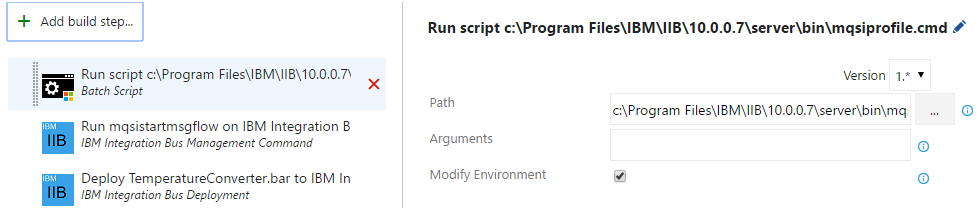
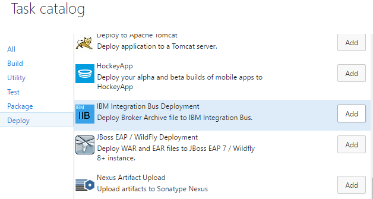
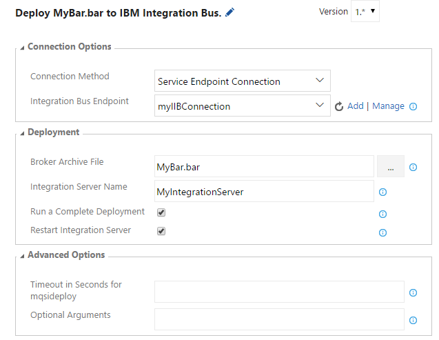
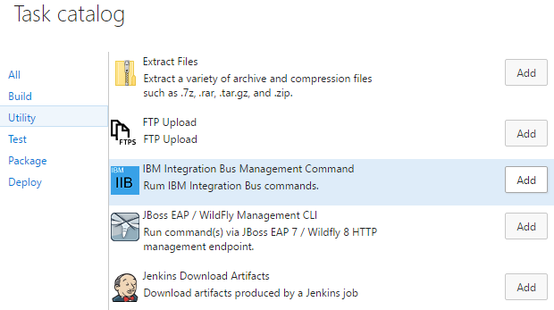
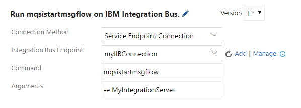
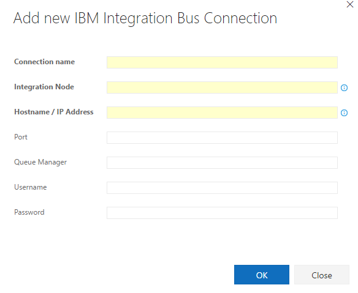

# [Visual Studio Team Services Extension for IBM Integration Bus](https://marketplace.visualstudio.com/items?itemName=ms-vsts.ibm-integration-bus)

This extension provides build tasks to manage and deploy Broker Archive (BAR) files to IBM Integration Bus v10.

This extension installs the following components:
* A service endpoint for connecting to IBM Integration Bus on Visual Studio Team Services and Team Foundation Server 2017.
* A build task to run commands on IBM Integration Bus.
* A build task to deploy BAR files to IBM Integration Bus.

## Prerequisites

* In order to automate the deployment of BAR files to IBM Integration Bus, the build agent must have access to the 'mqsi*' commands.  Please follow the IBM Integration Bus document to setup the command environment.
  * If the build agent is running on Windows, the "Batch Script" task can be used to run the 'mqsiprofile.cmd' script and setup the command environment.  Make sure 'Modify Environment' is checked.

    

## IBM Integration Bus Deployment Task

1. Open your build definition and add the "IBM Integration Bus Deployment" task.  The task can be found in the 'Deploy' section.

    

1. Details of the deployment task.

    

    * Setup [Connection Options](#setup-connection-options).
    * Enter the path to a BAR file.  Wildcards can be used, but the pattern must resolve to exactly one file.
    * Enter the Integration Server Name.  This is called "Execution Group" in prior versions of Integration Bus.  This Integration Server will be created if it does not exist.
    * By default _mqsideploy_ command does a delta or incremental deployment. Check the "Run a Complete Deployment" box if you want to override the behavior and run a complete deployment.
    * You can add additional arguments to _mqsideploy_ in the __Optional Arguments__ field.  Refer to IBM's documentation for all options _mqsideploy_ supports.

## IBM Integration Bus Command Task

1. Open your build definition and add the "IBM Integration Bus Command" task.  The task can be found in the 'Utility' section.

    

1. Details of the command task.

     

    * Setup [Connection Options](#setup-connection-options).
    * Enter the command and any arguments

### Setup Connection Options

The tasks provide three options to connect to IBM Integration Bus:

1. Connecting with an "IBM Integration Service Bus" endpoint.
    * This option is supported on Visual Studio Team Services and Team Foundation Server 2017.  On Team Foundation Server 2015, please use other options to connect.

    

    * __Connection name__: name used to identify this connection.
    * __Integration Node__: name of the Integration Node.  This is called "Broker" in prior versions of Integration Bus.
    * __Hostname / IP Address__: IP address or the hostname of the computer on which the Integration Bus is running. The hostname must be resolvable by the build agent. Do not prefix with protocol names if username and/or password is also supplied.
    * __Port__: optional, port of the Integration Bus.
    * __Queue Manager__: optional, the name of the queue manager.
    * __Username and Password__: optional, if supplied, will be used with values of _hostname_ or _ip address_ to construct the connection URL in the form of _tcp://${username}:${password}@${hostname}_.

1. Manually enter credentials.
    * The same fields from "IBM Integration Service Bus" endpoint section are repeated within the task.

1. Select a .broker file.
    * The supplied _.broker_ file must contain all connection information required for automated deployment, including deployment credentials.

## Contact Us

[Report an issue](https://github.com/Microsoft/vsts-ibm-integration-bus-extension/issues)
